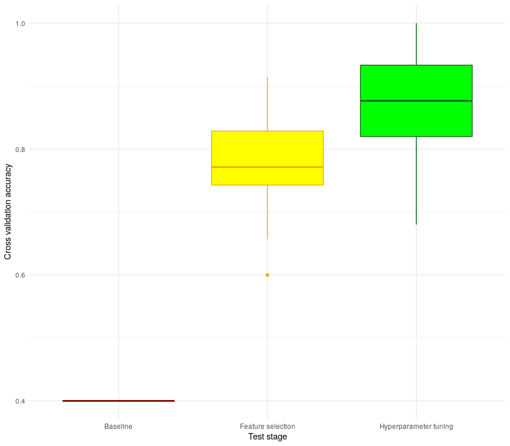

# Log files

Genereated with script (graphing commands were excluded to allow for continuous running of the script):

```bash
for i in {1..30};
	echo $i
	time python3 -u test_script.py > logs/test_$i.log 2> times1_30;
done
```

The real times were then extracted using:

```bash
cat logs/time1_30 | grep "real" | sed -e 's/real\t//g' | awk -F 'm' '{sum += $1*60 + $2} END { print sum/60/60 }'
#also added to new file for later spreadsheat making
cat logs/time1_30 | grep "real" | sed -e 's/real\t//g' > realtimes
```

This gave a total run time of **8.98 hours** (538.68 minutes).  
So the average time for runnigng a full script was **17.95 minutes**.

A .csv file of the baseline, model after feature selection, and model after hypertuning cross validation averages and variance, along with the number of features and time taken for script to run was then made using:

```bash
for i in logs/test_{1..30}.log; 
	do row=''; 
	tab=$(cat $i | sed -n -e '/Base RFC accuracy/,$p' | head -16 | grep -oP '(?<=Accuracy:    )[0-9.]+' | awk '{print $0, ","}'); 
	row="$row$tab";
	tab=$(cat $i | sed -n -e '/Base RFC accuracy/,$p' | head -16 | grep -oP '(?<=\+\/\- )[0-9.]+' | awk '{print $0, ","}');
	row="$row$tab";
	tab=$(cat $i | sed -n -e '/DIDN/,$p' | head -4 | tail -1 | grep -oP '(?<=TOP SCORE:    )[0-9.]+' | awk '{print $0, ","}');
	row="$row$tab";
	tab=$(cat $i | sed -n -e '/DIDN/,$p' | head -4 | tail -1 | grep -oP '(?<=BEST VAR:     )[0-9.]+' | sed -e 's/BEST VAR:    //g' | awk '{print $0, ","}'); 
	row="$row$tab";
	tab=$(cat $i | grep 'Best Score:' | sed -e 's/Best Score:   //g'| awk '{print $0, ","}');
	row="$row$tab"; 
	tab=$(cat $i | grep 'Best Var:' | sed -e 's/Best Var:     //g' | awk '{print $0, ","}'); 
	row="$row$tab";
	tab=$(cat $i | sed -n -e '/DIDN/,$p' | head -6 | tail -1 | grep -oP '(?<=New size:    )[0-9]+' | sed -e 's/New size:    //g' | awk '{print $0 ","}');
	row=$row$tab;
	echo $row >> trials.csv; 
done

cat realtimes | awk -F 'm' '{print $1*60 + $2}' | paste trials.csv - > acc_var.csv

rm realtimes
rm trials.csv
```




The routes were then extracted using:

```bash
for i in logs/test_{1..30}.log;
	do cat $i  | grep 'Route' | tail -1 | sed -e 's/Route:        //g' >> routes_temp.txt;
done

sed '$!s/$/,/' routes_temp.txt > routes.txt
rm routes_temp.txt
cat routes.txt | sed -e 's/\[(//g' | sed -e 's/)]//g' | sed -e 's/(//g' | sed -e 's/)//g' > routes.csv
```


The resulting routes.csv file was then used to generate the graph.


